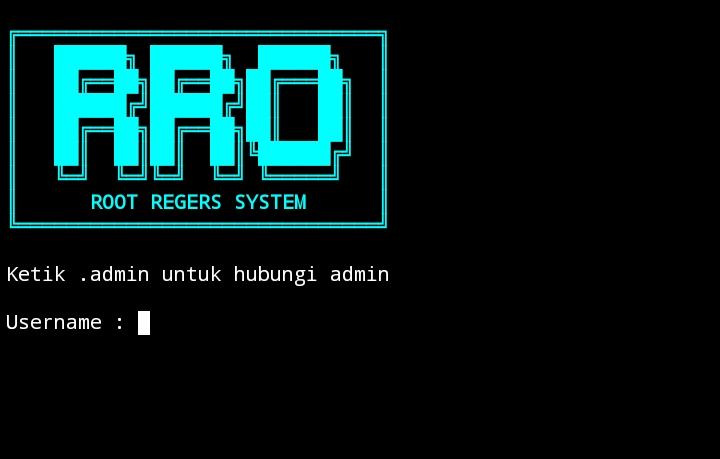
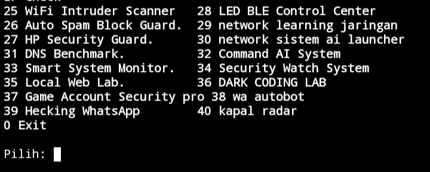

# Hacking WhatsApp 


[](https://youtu.be/AixTElRNRDE)
# Tutorial installing fitur Spamm WhatsApp 

[](https://youtu.be/VFf40qqesek)

## Tutor instaling Spamm call

[](https://youtu.be/b45nUelGcK0)


# apa itu Root_Regers ???
Root Power Toolkit adalah toolkit berbasis Termux untuk perangkat Android yang sudah di‑root (Magisk/KernelSU). Menyediakan berbagai fitur nyata seperti CPU &amp; RAM tweak, thermal control, SELinux manager, app freezer, network dan storage optimization dalam satu tool modular berbasis CLI

# Halaman Hacking-whatsApp





# Halaman Spamm WhatsApp 


fitur spamm WhatsApp yaitu berbayar dengan harga 30k kalo ingin fitur spamm WhatsApp silakan hubungi adminn ya

fitur Hacking WhatsApp ada 40 fitur dan fitur tersebut berfungsi semua dan pakai dengan bijak ya jangan di salahgunakan 

# kalo kakak mau masuk ke spamm wa nya untuk bisa spamm wa dan spamm coll jalanin code ini di termux
setelah kalian masuk kehalam terminal ./main_loader.sh nya kalian tinggal mencet crtl+z nah itu langsung masuk ke menu awal dan kalian jalankan kemabali yaitu kode ini kalo kalian mau masuk kefitur spam wa ini
```
cd cd 'Spamm wa'
chmod +x loader.sh
./loader.sh
```
# update spamm call WhatsApp 


# ROOT POWER TOOLKIT ☠

Root Power Toolkit adalah toolkit berbasis Termux untuk perangkat Android yang sudah di‑root (Magisk / KernelSU). Tool ini menyediakan berbagai fitur sistem tingkat lanjut seperti CPU & RAM tweak, thermal control, SELinux manager, app freezer, network dan storage optimization dalam satu CLI tool modular.

# di sini kita juga ada fitur spamm wa
setelah kalian masuk kehalam terminal ./main_loader.sh nya kalian tinggal mencet crtl+z nah itu langsung masuk ke menu awal dan kalian jalankan kemabali yaitu kode ini kalo kalian mau masuk kefitur spam wa ini
```
cd brutall_whatsapp
chmod +x loader.sh
./loader.sh
```
# kalo pas masukin pasword nya eror
ketik ini dulu CD $home lalu
ketik lagi cd Hacking-WhatsApp

dan kalian masuk ke halaman cd ini
Hacking-WhatsApp 
intaling code nya di halaman cd Hacking-WhatsApp ini
jalankan perintah di bawah ini
```
pkg install python
pip install requests
python --version
pip install fake-useragent
./loader.sh
```
kalo pas masuk pasword nya kayak gitu lagi tulisan nya langsung masuk ke CD~/Hacking-WhatsApp/brutall_whatsapp  jalankan di bawah ini 
```
python -m pip install -r data/requirements.txt
```

## ⚠️ Peringatan
Gunakan dengan bijak Risiko ditanggung pengguna dan juga ada fitur baru juga yaitu spamm wa dan di sini resiko nya bukan di tanggung saya tetapi di tanggung oleh pengguna 

# apa fungsi fitur Account security scanner ???

Fitur Account Security Scanner ini dirancang sebagai alat analisis keamanan akun digital secara umum, mencakup akun game (seperti Free Fire, Mobile Legends, PUBG), akun online, dan akun berbasis ID lainnya. Fungsinya bukan untuk membobol akun, melainkan untuk mengecek tingkat keamanan akun dari sisi pengguna, seperti validasi format ID, status aktivitas akun (aktif/tidak), pola risiko umum (akun jarang diganti sandi, login di banyak perangkat, tidak ada proteksi tambahan), serta simulasi seberapa mudah akun tersebut menjadi target pencurian jika kebiasaan pengguna buruk. Dengan fitur ini, pengguna bisa memahami posisi keamanan akun mereka sendiri sebelum terjadi masalah seperti akun diambil alih atau terkena phising.

Keunggulan spesialnya ada pada pendekatan multi-akun dan edukatif: satu menu bisa digunakan untuk berbagai platform, hasilnya ditampilkan dalam indikator risiko (AMAN / WASPADA / RAWAN), lengkap dengan rekomendasi nyata yang bisa langsung diterapkan di dunia nyata (contoh: binding akun, pengamanan perangkat, kebiasaan login yang benar). Sistem ini juga bisa menyimpan log analisis agar pengguna bisa memantau perubahan tingkat keamanan akun dari waktu ke waktu. Jadi fitur ini cocok buat pengguna yang ingin melindungi akun-akunnya secara cerdas, bukan sekadar coba-coba atau melanggar aturan.

# Cara jalanin WiFi Intruder Scanne
salin kode termux ini biar wifi nya aktif dan bisa jalanin halaman fitur menu ini 
```
ip route
pkg install iproute2 iputils -y
```
# cek terlebih dahulu pake kode
ip route dan harus ada imput ini
- default via 192.168.1.1 dev wlan0

## ✨ Fitur
- Root Check
- System Information
- Mount System RW
- Hosts Adblock
- CPU Performance Tweak
- GPU Boost
- RAM Cleaner
- Disable Thermal Service
- Freeze & Unfreeze App
- Battery Saver
- IO Scheduler Tweak
- Network Boost
- SELinux Status & Permissive
- Basic Root Hide
- Service Manager
- Reboot Menu
- Storage Trim
- Package Manager
- Logcat Monitor
- Kernel Info
- Backup Aplikasi
- WiFi Intruder Scanner
- Auto Spam Block Guard
- AI Sistem
- Account security scanner
- wa autobot
- scaning keamanan akun Game
- Hacking akun WhatsApp 
- Radar kapal aktif 
- Spamm wa

# Hubungi admin
- Hubungi admin untuk mendapatkan katasandi server nya
- https://wa.me/85283786794

# buka kunci main.sh nya harus hubungi admin terlebih dahulu
```
gpg -d main.sh.gpg > main.sh
chmod +x main.sh
./main.sh
```
# kalo kode nya eror
jalanin perintah di bawah ini
👇👇👇👇👇👇👇👇👇👇
salin semua kode ini paste ke termux
```
pwd
ls
r
m -rf modules
mkdir modules
ls modules
mv \
root_check.sh system_info.sh mount_rw.sh hosts_block.sh \
cpu_tweak.sh gpu_tweak.sh ram_cleaner.sh thermal_off.sh \
app_freezer.sh app_unfreeze.sh battery_saver.sh io_tweak.sh \
network_boost.sh selinux_status.sh selinux_permissive.sh \
hide_root_basic.sh service_manager.sh reboot_menu.sh \
storage_boost.sh pkg_manager.sh logcat_monitor.sh \
modules/
ls modules
chmod +x main.sh login.sh
chmod +x modules/*.sh
ls -l modules/root_check.sh
./modules/root_check.sh
bash login.sh
```
# 📋CARA MENAMBAH / MENGUPGRADE MENU DI ROOT RAGERS BOT

ROOT RAGERS BOT adalah bot WhatsApp yang memungkinkan pengguna untuk berinteraksi melalui chat, dan admin dapat menambahkan, mengubah, atau menghapus menu, harga, stok, voucher, dan promo langsung melalui chat WhatsApp. Sistem bot ini menggunakan session WhatsApp melalui QR code, jadi hanya nomor yang scan QR yang dianggap sebagai admin resmi, sementara nomor lain hanya bisa mengakses menu dan melakukan perintah terbatas seperti “beli” atau melihat menu, tanpa dapat mengubah konfigurasi

Sebelum admin dapat menambahkan atau mengubah menu, pastikan nomor admin sudah diatur
```
const admin = "628xxxxxxx";  // Nomor admin WA
const adminJid = admin + "@s.whatsapp.net"
```
- Scan QR hanya perlu dilakukan dengan nomor admin ini, agar session aktif di bot mengenali perintah admin
- Jika nomor lain (termasuk nomor bot) yang scan QR, maka perintah admin tidak akan diakui dan chat akan dibalas default “Ketik menu 😊”
- Pastikan session lama dihapus    sebelum scan QR baru
- Dengan kode di bawah ini
 ```
  rm -rf session_62*
```

# kode buat jalanin wa autobot
```
npm init -y
npm install @whiskeysockets/baileys pino chalk readline-sync qrcode-terminal
```
# kalo eror wa autobot nya
jalanin kode ini di termux 
- hapus calk lama
```
npm uninstall chalk
```
- install calk versi terbaru
```
npm install chalk@4
```
- jalan kan lagi
```
bash login.sh
```
``
## 📦 Instalasi (Termux)

```bash
pkg update -y && pkg upgrade -y
pkg install git tsu -y
pkg install python -y
pip install psutil colorama
npm install qrcode-terminal
npm install readline-sync
pkg install git
git clone https://github.com/jiwhwhnbagwhvev-sys/Hacking-WhatsApp.git
cd Hacking-WhatsApp
chmod +x auth_system.sh
chmod +x auth_hidden.sh
chmod +x login_loader.sh
chmod +x main_loader.sh
chmod +x loader.sh
./login_loader.sh
```
# kalo kode nya eror
dan kalian sudah masuk ke menu 
cd Root_Ragers kalian jalanin kode ini
```
pkg update
pkg upgrade
pkg install gnupg
```
Baru kalian jalankan lagi kode ini di termux 
```
./login_loader.sh
 ```
# selesai kalian masukin username sama password nya di halaman login
kalian masukan kode ini untuk menjalankan main.sh
ini fitur utama nya
```
./main_loader.sh

```
